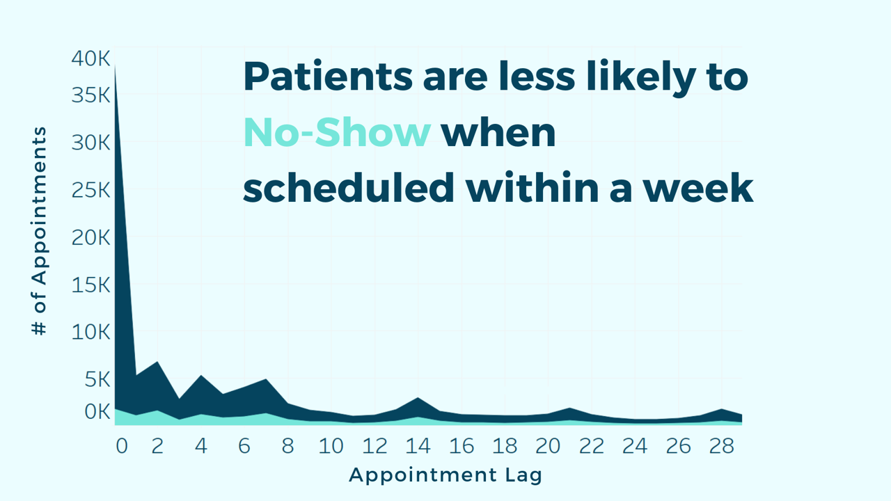
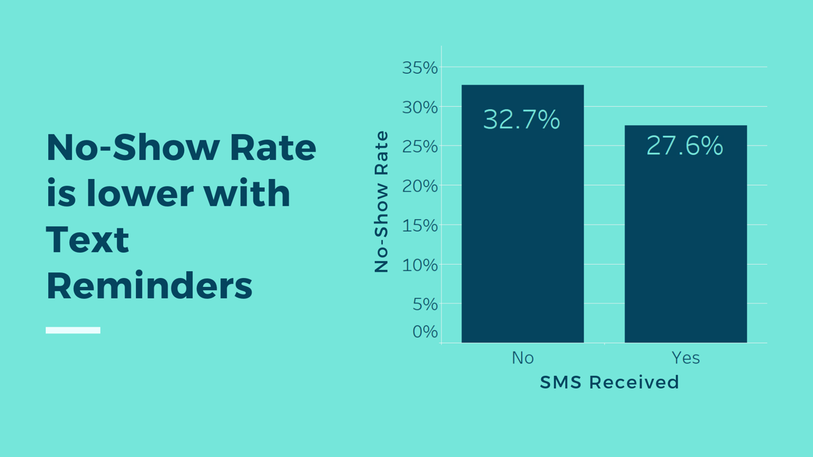
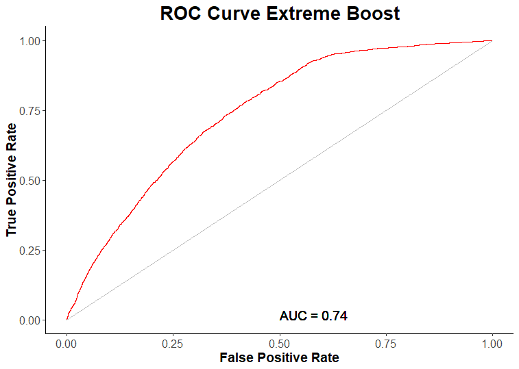

                                          **MODELLING PATIENT NO-SHOWS**
                                                   Aman Panwar

**Overview**

Patient no-shows are a very popular problem in the healthcare industry. Many studies have been done citing no-show rates ranging from 5% to more than 30%. A patient no-show is bad for all involved parties. The healthcare organization loses revenue, the patient fails to receive treatment, and the community at large suffers from inefficient utilization of the healthcare system. Our goal is to use a dataset from Brazil to identify which appointments result in no-show (supervised classification problem). While the dataset is from Brazil, many human behaviors transcend borders. The insights gathered through this process can generally be applied to the global issue.

Rattle,a graphical user interface for data science with R, is used for processing data and building models and Tableau is used to visualize data. Rattle file used to build the models are also uploaded in the repository.

Results obtained from models are then used to create a class to compute no show score for patients.

Before we begin modeling, we will walk you through the dataset description, preprocessing and exploratory analysis of our dataset.


```python
#import libraries
import pandas as pd
import numpy as np
import os

#working directory
path= "C:/Users/panwaraman/Desktop/GitHub/Data_science_uiowa_project/noshowappointments"
os.chdir(path)

#read datasets
df=pd.read_csv("data1.csv")
df.head()
```


<table border="1" class="dataframe">
  <thead>
    <tr style="text-align: right;">
      <th></th>
      <th>PatientId</th>
      <th>AppointmentID</th>
      <th>Gender</th>
      <th>ScheduledDay</th>
      <th>AppointmentDay</th>
      <th>AppointmentLag</th>
      <th>Age</th>
      <th>Neighbourhood</th>
      <th>Scholarship</th>
      <th>Hypertension</th>
      <th>Diabetes</th>
      <th>Alcoholism</th>
      <th>Handicap</th>
      <th>SMS_received</th>
      <th>No-show</th>
    </tr>
  </thead>
  <tbody>
    <tr>
      <th>0</th>
      <td>2.990000e+13</td>
      <td>5642903</td>
      <td>F</td>
      <td>4/29/2016</td>
      <td>4/29/2016</td>
      <td>0.0</td>
      <td>62</td>
      <td>JARDIM DA PENHA</td>
      <td>0</td>
      <td>1</td>
      <td>0</td>
      <td>0</td>
      <td>0</td>
      <td>0</td>
      <td>No</td>
    </tr>
    <tr>
      <th>1</th>
      <td>5.590000e+14</td>
      <td>5642503</td>
      <td>M</td>
      <td>4/29/2016</td>
      <td>4/29/2016</td>
      <td>0.0</td>
      <td>56</td>
      <td>JARDIM DA PENHA</td>
      <td>0</td>
      <td>0</td>
      <td>0</td>
      <td>0</td>
      <td>0</td>
      <td>0</td>
      <td>No</td>
    </tr>
    <tr>
      <th>2</th>
      <td>4.260000e+12</td>
      <td>5642549</td>
      <td>F</td>
      <td>4/29/2016</td>
      <td>4/29/2016</td>
      <td>0.0</td>
      <td>62</td>
      <td>MATA DA PRAIA</td>
      <td>0</td>
      <td>0</td>
      <td>0</td>
      <td>0</td>
      <td>0</td>
      <td>0</td>
      <td>No</td>
    </tr>
    <tr>
      <th>3</th>
      <td>8.680000e+11</td>
      <td>5642828</td>
      <td>F</td>
      <td>4/29/2016</td>
      <td>4/29/2016</td>
      <td>0.0</td>
      <td>8</td>
      <td>PONTAL DE CAMBURI</td>
      <td>0</td>
      <td>0</td>
      <td>0</td>
      <td>0</td>
      <td>0</td>
      <td>0</td>
      <td>No</td>
    </tr>
    <tr>
      <th>4</th>
      <td>8.840000e+12</td>
      <td>5642494</td>
      <td>F</td>
      <td>4/29/2016</td>
      <td>4/29/2016</td>
      <td>0.0</td>
      <td>56</td>
      <td>JARDIM DA PENHA</td>
      <td>0</td>
      <td>1</td>
      <td>1</td>
      <td>0</td>
      <td>0</td>
      <td>0</td>
      <td>No</td>
    </tr>
  </tbody>
</table>
</div>


**Dataset description**

Data is obtained through Kaggle. It contains 110,527 instances and a breakdown of variables is below.


**Pre-Processing**

*Created new column:*
Because the dataset represents less than 2 months of appointments, we created a variable AppointmentLag measuring the number of days between when the appointment was scheduled and the actual date of the appointment.

*Missing value imputation:*
While there were no missing values, there were a few lines that exhibited values that did not make sense. One instance had an age value of -1, which was imputed with the median age of the dataset of 37. In addition, 5 instances had an AppointmentLag that was negative, indicating that the appointment was scheduled after it was over. These instances were imputed with 0.
The two identifiers, PatientID and AppointmentID were ignored along with AppointmentDay and ScheduledDay.

*Categorical variables converted to indicator & Rescaling:*
Gender and Neighbourhood were converted from categorical to indicator variable, and our numerical attributes (Age, Handicap, and AppointmentLag) were rescaled to 0-1.

**Exploratory Analysis**

The no-show rate of the dataset is 20.2%


The no-show rate by age tends to be higher than the population average for patients younger than 45. It should be noted that the variation in rate increases drastically in patients older than 80 years old. This is due to having less datapoints for these ages.





Patients who scheduled their appointment within a week tend to show more often than those who schedule further out. This is especially true for patients who have same day schedule (lag time = 0).This variable will likely be useful in models.


Patients with a chronic illness are more likely to show up for their appointment. This is true for those with hypertension and diabetes.


The scholarship variable indicates that those patients on a social welfare program are more likely to miss their appointment than those who are not. Essentially, this is an indicator for patients with limited financial resources. 





We hypothesized that patients who received text reminders would be more likely to show up to their appointment, however our initial analysis did not show this. Upon further exploration we found that patients who scheduled their appointment within 3 days did not receive text reminders. Once appointments with this lag time were excluded, the rate for those with reminders are lower than those without.

**Models**

Because of the skewed nature of our dataset, we will use the area under the ROC curve (AUC) to evaluate and compare each model.

**Decision Tree**

For this dataset, the most impactful features were: Appointment Lag, Age, and Neighborhood_Santos.Dumont. These were the features the dataset was split in that provided the most information gain regarding the target variable of whether a patient would no-show or not

**Logistic Regression**

7 features in this model were statistically significant with p values of less than 0.05. The features are as followed: Age, Appointment Lag, SMS received, Scholarship, Hypertension, Alcoholism, and Diabetes.

**Support Vector Machine**

When executing SVM models, a variety of issues arose. Increasing complexities and/or increasing degree (in the case of polynomial kernels) led to models that could not be executed. The solution here was to remove the neighborhood feature since it was categoric with 81 levels. 

**Random Forest**

Out of models with same AUC score, model with relatively a smaller number of trees was selected as it reduces the computation complexity and time.
The variable importance table was used to select the variables with higher predictive powers. Based on this table, the variables that had higher predictive power are appointmentlag, age, sms-received, scholarship (financial assistance) and alcoholism. 

**Ensemble models**

Boosting methods have increased in popularity of late because they can often provide better results than other modeling approaches. This was also observed in our case where AdaBoost and Gradient Boost methods gave best AUC value.
  
**Neural Network**

Neural networks are interesting models in that they try to replicate processes involved in the human mind. Artificial neuron models are based on neurons. Pieces of the initial input are interpreted via the hidden layers to help build the neural network similar to how the human mind processes information and learns.

**Evaluation**

Model Comparison and Selection

The models were evaluated by using AUC performance metric because:

1. Our no-show appointments dataset is unbalanced
2. Model operating conditions are not known

AUC is used when a single number is needed to summarize the model performance or when nothing is known about operating conditions.

Below is a summary table of the different classification models tested as well as the best AUC achieved for each model.


Our best selected Gradient Boost model (AUC 0.74) was evaluated against the Test (0.7422) and validation dataset (0.7351). A plot of the ROC curve of this model is below. 





**Using the results from models, we can create a 'Hospital_apt' class to compute no show score for new patients.**


```python
class Hospital_apt:
        
        def __init__(self,aptlag,age,hyprtnsn,diabetes,poor,txtrmndr):
        #appointment lag is the duration between the day an appointment is made and the day an appointment is
                self.__aptlag=aptlag
        #age is an age of patient        
                self.__age=age
        #hyprtnsn is whether a patient has high blood pressure        
                self.__hyprtnsn=hyprtnsn
        #diabetes is whether a patient has diabetes       
                self.__diabetes=diabetes
        #poor is whether a patient recieved financial assistance        
                self.__poor=poor
        #txtrmndr is whether a patient recieved a text reminder        
                self.__txtrmndr=txtrmndr


        #function to calculate score to determine the likeliness of patient to show up to an appointment
        def pat_score(self):
            score=0

        #appointment lag of within a week increases the chances of patient showing up to an appointment    
            if self.__aptlag <=1:
                    score= score+1
        #Patient older than 44 are likely to show up to an appointment             
            if self.__age >44:
                    score= score+1
        #Patient suffering from hypertension are likely to show up to an appointment         
            if self.__hyprtnsn =='yes':
                    score= score+1
        #Patient suffering from diabetes are likely to show up to an appointment  
            if self.__diabetes =='yes':
                    score= score+1
        #Patient 'not' recieving financial assistance are likely to show up to an appointment              
            if self.__poor =='no':
                    score= score+1
        #Patient recieving text reminder are likely to show up to an appointment 
            if self.__txtrmndr =='yes':
                    score= score+1

        #A higher score indicates more likeliness to show up to an appointment           
            if score == 0 or score ==1 or score ==2:
                category='least likely to show up'
            elif score ==3 or score ==4:
                category='less likely to show up'
            else:
                category='more likely to show up'
                    
            score=str(score)

            book_list=[score,category] 
            return (book_list)
```


```python
import hospital

def main():
    aptlag= float(input('Enter the appointment lag in weeks:'))
    age= int(input('Enter the age in years:'))
    hyprtnsn= input("Enter 'yes' if patient has hypertension:")
    diabetes=input("Enter 'yes' if patient has diabetes:")
    poor=input("Enter 'no' if patient does not recieve any financial assistance:")
    txtrmndr=input("Enter 'yes' if patient recieved any text reminder:")
    
    pat_object=hospital.Hospital_apt(aptlag,age,hyprtnsn,diabetes,poor,txtrmndr)
    score_list=pat_object.pat_score()
    print("This patient's showup score is ",score_list[0]," and is ",score_list[1] )
    
main()
```

**Model improvements**

This model may be improved by the introduction of additional variables. Variables we recommend are as follows:

*Patient Wait-Time:* Having this variable would allow us to see if patients who no-show more frequently also have larger wait times historically.

*Patient Proximity:* The distance patients have to travel to their appointments may provide better insight as to whether distance or travel impacts no-shows.

*Insurance Type:* we observed a difference in no-show rate between patients who are part of a government welfare program vs. those who are not. Adding in different insurance types may allow us to differentiate the financial impact the appointment has across the patient population.

*Appointment Visit Type:* The reason for the appointment may provide additional information to differentiate patients who show vs. no-show. For instance, perhaps patients are more likely to miss an annual appointment rather than an appointment that requires a procedure.

*Time of year:* Our data included less than 2 months’ worth of data so gathering data that spans at least a year would allow us see if the time of year impacts no-shows. 

**Business Insights**

Using the insights from Gradient Boost model , we can make recommendations to decrease the number of no-show appointments.

*SMS Received:* To reduce the no-show rate, we recommend a need to automate SMS approach to ensure all patients receive text reminders. Perhaps requesting multiple cells numbers to text to add to likelihood patient shows up for appointments.

*Appointment Lag-Time:* We suggest that appointments scheduled further than a week in advance be confirmed by the patient a week before the appointment. Patients who do not confirm may be prompted to reschedule and their appointment slot can be filled by other patients.

*Age:* From the predicted model, it was evident that young people are more likely to miss appointments. Hence, educating the young people about the why not showing up to an appointment is a problem. It is quite possible that people may at least cancel in advance if they know that their absence is noticed and a concern. 

**Supporting Information:**

Please check these documents for additional information.

Patient_No_Show.rattle: Rattle file that contains code for machine learning models.

Patient_No_Show.doc: Detailed word report of this project.

Patient_No_Show.csv: Patient_No_Show data.


